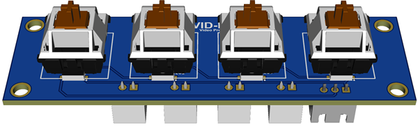

# GP2040 Configuration for VID-PRO-PTZ Controller

GitHub repo for the VID-PRO-PTZ Controller:
<https://github.com/pvtex/GP2040-CE>

For PCB fabrication files look in the [assests/Board](assests/Board) directory

## Main Pin Mapping Configuration

| RP2040 Pin | Action                        | GP2040 | Xinput | Switch | PS3/4/5  | Dinput | Arcade | VID-PRO |
|------------|-------------------------------|--------|--------|--------|----------|--------|--------|---------|
| GPIO_PIN_06| GpioAction::BUTTON_PRESS_B1   | B1     | A      | B      | Cross    | 2      | K1     | CAM01   |
| GPIO_PIN_07| GpioAction::BUTTON_PRESS_B2   | B2     | B      | A      | Circle   | 3      | K2     | CAM02   |
| GPIO_PIN_08| GpioAction::BUTTON_PRESS_B3   | B3     | X      | Y      | Square   | 1      | P1     | CAM03   |
| GPIO_PIN_09| GpioAction::BUTTON_PRESS_B4   | B4     | Y      | X      | Triangle | 4      | P2     | CAM04   |
| GPIO_PIN_10| GpioAction::BUTTON_PRESS_S2   | S2     | Start  | Plus   | Start    | 10     | Start  | TOP-BTN |
|------------|-------------------------------|--------|--------|--------|----------|--------|--------|---------|
| GPIO_PIN_26| X-Axis                        |        |        |        |          |        |        | PAN     |
| GPIO_PIN_27| Y-Axis                        |        |        |        |          |        |        | TILT    |
| GPIO_PIN_28| X-Axis (second stick)         |        |        |        |          |        |        | ZOOM    |
|------------|-------------------------------|--------|--------|--------|----------|--------|--------|---------|
| GPIO_PIN_0 | IIC SDA OLED Display          |        |        |        |          |        |        |         |
| GPIO_PIN_1 | IIC SCL OLED Display          |        |        |        |          |        |        |         |
|------------|-------------------------------|--------|--------|--------|----------|--------|--------|---------|
| GPIO_PIN_15| WS2812B LEDs                  |        |        |        |          |        |        |         |

